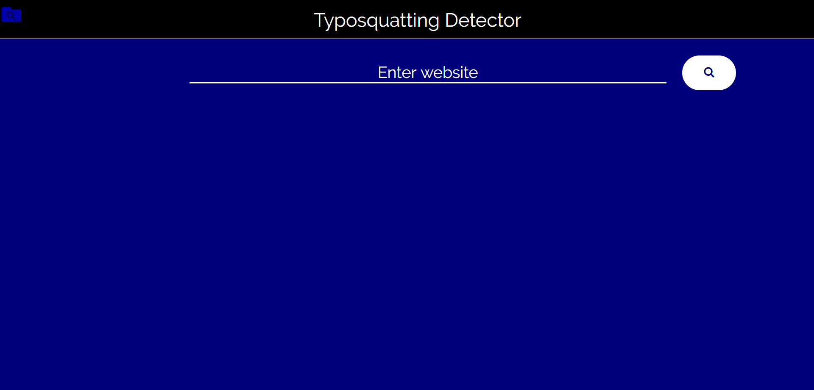
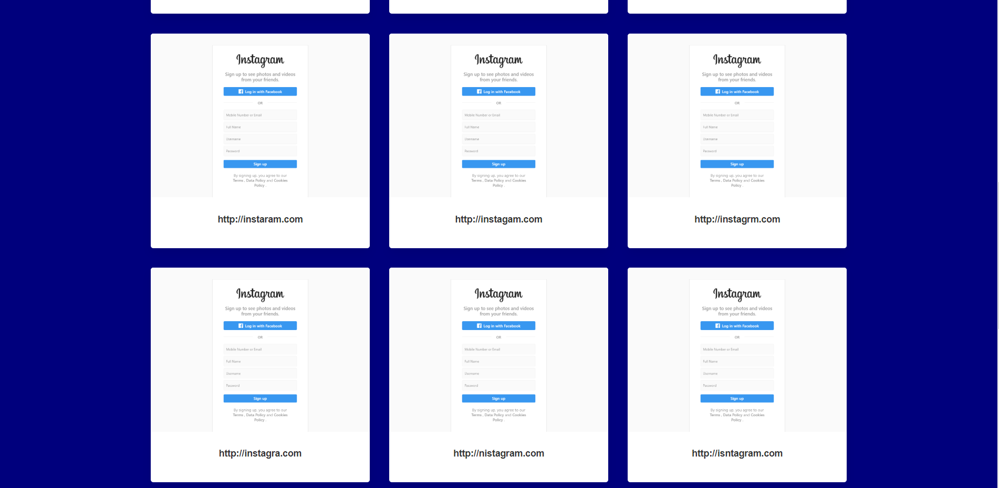
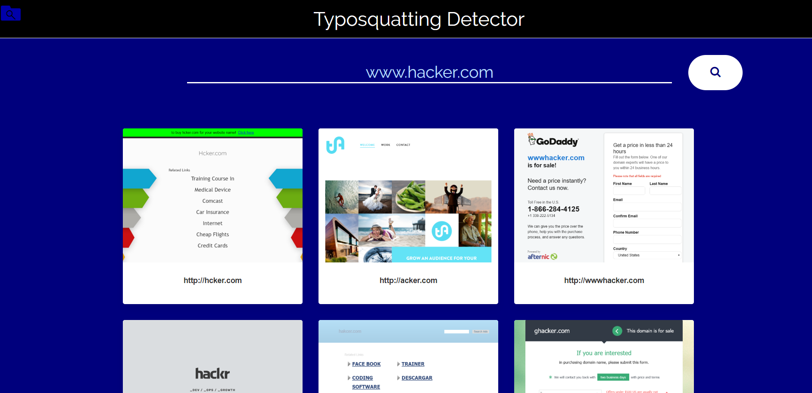
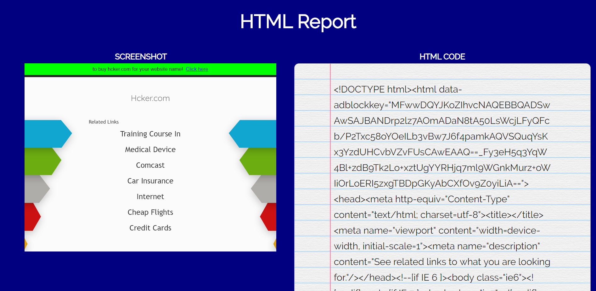

# Typosquatting-Detector

<b>General information :</b>  
Domain squatting refers to the attackers' practice of using domain names that are deceptively similar to popular domain names, as a way of getting user traffic and confusing users about the nature of any one given site. The most popular type of domain squatting is called typosquatting and it capitalizes on a user's typos. Attackers register domain such as twwitter.com (two 'w's instead of one), wwwpaypal.com (missing dot between "www" and paypal.com) and gankofamerica.com (neighboring character of 'b') and can then expose users to a wide range of abuse.

<b>Project description :</b>  
Purpose of this project is to design and implement a distributed typosquatting detector. Architecture consists of one master node and N worker nodes. The master node receives a new job (request to scan for typosquatting domains for a new domain), generates the possible squatting variants, and then places these variants in a queue. Worker nodes will consume domains from that queue, and then visit these domains using a headless Chrome browser. Each worker then reports back to the master node with a screenshot and the HTML code of each "alive" typosquatting domain. The master node then assembles these in an HTML report which the user of this tool can inspect using a web dashboard.

<b>Project components :</b>  
<ul>
  <li>
    
Master node with web dashboard where users can submit new scans and see the resulting reports of old scans. 
Given a domain name, the master node generates the possible typosquatting variants of that domain name and request the workers to scan them.  
    

  </li>
  <li>
    

The master node must push all possible typosquatting variants to a queue where they will be consumed by one or more workers.  
    

  </li>
    <li>
    

Each worker node uses Headless Chrome to "crawl" each variant, collecting a screenshot and the HTML code of each discovered typosquatting domain.  
    

  </li>
  <li>
    

Producer-consumers system provides a way for new workers to "report for duty" and be added to the pool of available scanning nodes.
Scaling is as easy as registering new workers. 
    

  </li>
</ul>
<b>Languages, Frameworks, Libraries etc. :</b>
<ul>
  <li>
    
Node.js : it was greater fit for the project over python, java, etc.

  </li>
  <li>
    
Express.js : really simplifies working with Node.js when dealing with http requests.

  </li>
  <li>
    
<a href='https://github.com/bee-queue/bee-queue' target='_blank'>bee-queue</a> : main node-package used for implementing distributed worker system. Great package, similar to <a href='https://github.com/Automattic/kue' target='_blank'>Kue</a> and <a href='https://github.com/OptimalBits/bull' target='_blank'>Bull</a>, i found it easier to implement vs the others.

  </li>
  <li>
    
<a href='https://redis.io/' target='_blank'>Redis</a> : in-memory data structure store, used as a database, cache and message broker. Used to store information about jobs stored on the job queue

  </li>
  <li>
    
MySQL : standard  CRUD DB operations

  </li>
  <li>
    
<a href='https://github.com/puppeteer/puppeteer' target='_blank'>Puppeteer</a> : simple and great Headless Chrome API, used for crawling websites. Retrevieng the HTML source code and screenshot of the website in this case.

  </li>
  </ul>
  <b>Demo pictures : </b>
  
(Homepage)

  </img>
  
(User enters Instagram as the original domain name, and gets results)

  </img>
  
(Cont. Most of the screenshots give the same results on popular domains because attackers often mimic the original domain's hompage to trick users into thinking its the original domain)

  </img>
  
(Cont.)

  </img>
  
(Entering a different domain name, less popular one.)

  </img>
  
(Cont.)

  </img>
  
(Result page example)

  </img>

